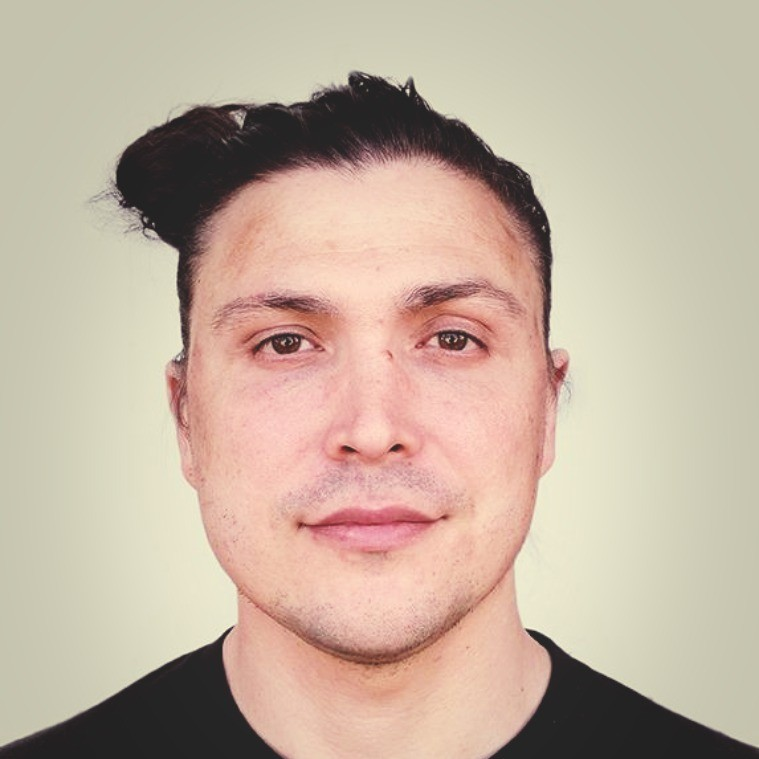

&nbsp;

## Nicolas Venkovic 

[Home](https://venkovic.github.io/), [Research](https://venkovic.github.io/research.html), [Teaching](https://venkovic.github.io/teaching.html) 

&nbsp;

 

&nbsp;

Follow me on [GitHub](https://github.com/venkovic/), [Google Scholar](https://scholar.google.com/citations?user=BqB0tioAAAAJ&hl=en), [ORCID](https://orcid.org/0009-0003-5063-8125), [LinkedIn](https://www.linkedin.com/in/nicolas-venkovic-97195b42/).

### *Current position*

Scientific Staff Member @ [Technical University of Munich](https://www.tum.de/en/) (since 07/2024) 

### *Education*

<!--**HDR** Applied Mathematics @ [Université de Quelque Part]() (XX/XXXX) -->**PhD** Applied Mathematics & Scientific Computing @ [Université de Bordeaux](https://www.u-bordeaux.fr/en) (09/2023) **MSE** Applied Mathematics & Statistics @ [Johns Hopkins University](https://www.jhu.edu/) (05/2018) **MSE** Mechanical Engineering @ [Johns Hopkins University](https://www.jhu.edu/) (12/2016) <!--**BEng, MSc** Civil Engineering @ [Université Laval](https://www.ulaval.ca/en/) (2011, 2013) -->

### *Positions held*

Software Developer @ [NXP Semiconductors](https://www.nxp.com/) (09/2022 - 04/2024) Doctoral Researcher @ [Cerfacs](https://cerfacs.fr/en/), [Parallel Algorithms](https://cerfacs.fr/en/parallel-algorithms/) (10/2018 - 10/2021) Research Assistant @ [Johns Hopkins University](https://www.jhu.edu/) (09/2013 - 09/2018) <!--Research Assistant @ [Université Laval](https://www.ulaval.ca/en/) (05/2011 - 08/2013) Graduate Visiting Student @ [Massachusetts Institute of Technology](http://www.mit.edu/) (09/2011 - 02/2012) Research Intern @ [Phimeca Engineering](http://phimeca.com/en/) (05/2011 - 08/2011) Research Assistant @ [Université Laval](https://www.ulaval.ca/en/) (05/2008 - 12/2010) -->

### <!--*Selected open source contributions*-->

<!--Parallel iterative solvers for Fredholm integral equations: [Fredholm]()  (C), [Fredholm.jl]()  (Julia) Randomization of parallel iterative solvers: [Ginkgo]()  (C++) Parallel FFT-based iterative solvers for homogenization: [FFTHom]()  (C), [FFTHom.jl]()  (Julia) Algorithms for Minkowski tensors of Voronoi Diagrams: [VoroMinkowski]()  (C), [VoroMinkowski.jl]()  (Julia) -->

### *Awards and distinctions*

Bravo Award, [NXP Semiconductors](https://www.nxp.com/)  <!--(2023)--> USNCCM14 Travel Award, [US Association of Computational Mechanics](https://www.usacm.org/) <!--(2017)--> HEMI Travel Grant, [Hopkins Extreme Materials Institute](https://hemi.jhu.edu/) <!--(2016)--> Meyerhoff Fellowship, [Johns Hopkins University](https://www.jhu.edu/) <!--(2013)--> CEE Department Fellowship (unclaimed), [Massachusetts Institute of Technology](http://www.mit.edu/) <!--(2013)--> Canadian National Scholarship, [Canadian National Railway Company](https://www.cn.ca/en/) <!--(2013)--> Excellence Award, [Université Laval](https://www.ulaval.ca/en/) <!--(2013)--> Michael Smith Foreign Study Supplement, [NSERC](http://www.nserc-crsng.gc.ca/index_eng.asp) <!--(2011)--> Alexander Graham Bell Scholarship, [NSERC](http://www.nserc-crsng.gc.ca/index_eng.asp) <!--(2011)--> Inter-University Scholarship, [CRIB](https://lecrib.ca/en/index.php) <!--(2011)--> Master's Scholarship, 2nd-best candidature in Province of Quebec, [FQRNT](http://www.frqnt.gouv.qc.ca/en/accueil) <!--(2011)--> Undergraduate Student Research Award, [NSERC](http://www.nserc-crsng.gc.ca/index_eng.asp) <!--(2010)--> Merit Scholarship (unclaimed), [CROUS](http://www.crous-paris.fr/) <!--(2006)-->          

### <!--*Memberships*-->

<!--[Society for Industrial and Applied Mathematics](https://www.siam.org/) [Association of Applied Mathematics and Mechanics](https://www.gamm.org/en/)-->

